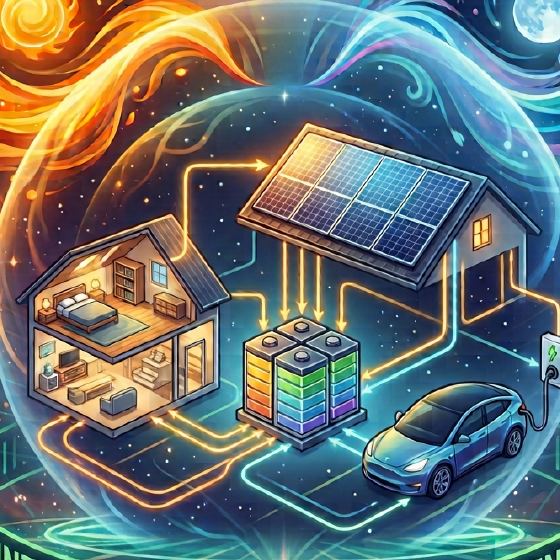
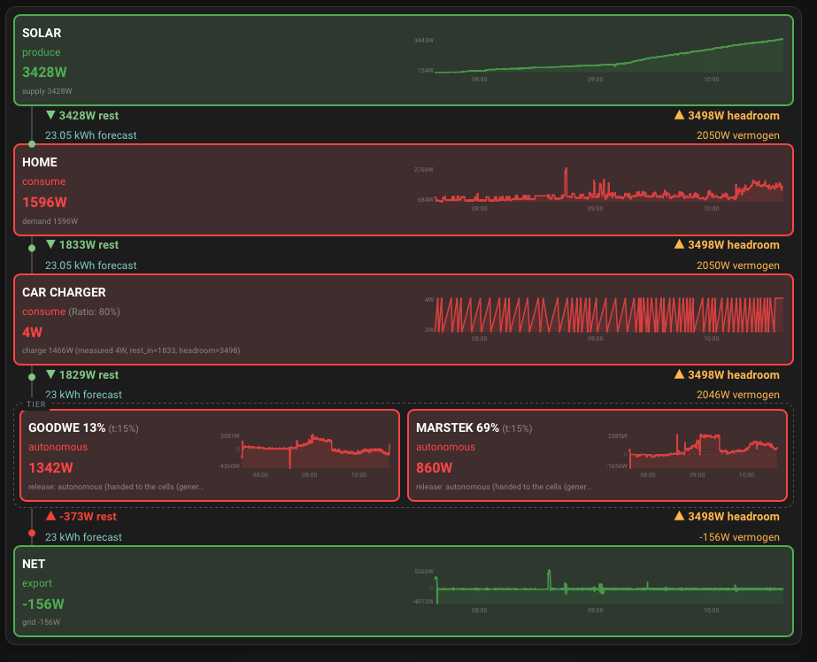

<p align="center">
  
</p>

<h1 align="center">Energy Balancer</h1>

<p align="center">
  <em>Decides which of your energy devices gets the next watt — and never lets any of them
  set a new grid peak.</em>
</p>

<p align="center">
  <a href="https://github.com/hacs/integration"></a>
  <a href="LICENSE"></a>
  <a href="https://github.com/jebeke65/ha-energy-balancer/actions/workflows/validate.yml"></a>
</p>

<p align="center">
  <strong><a href="https://jebeke65.github.io/ha-energy-balancer/">📖 Full documentation</a></strong>
</p>

---

## The problem

A house with solar panels, a battery or two and a car charger has a scheduling problem.
The sun makes a surplus that has to go somewhere. The house draws a load that has to
come from somewhere. Every device has its own app, its own idea of "self-consumption",
and no idea the others exist.

Left alone they compete. The car charger and the battery both reach for the same
surplus. At dusk both discharge into a house that only needed one of them.

And on the wrong morning, one of them starts importing hard enough to set a monthly
peak — a number that, on a capacity tariff, you then keep paying for long after the
morning is forgotten.

## What this does

Energy Balancer puts those devices in a single line and gives them an order of
precedence. Several times a minute it works out how much surplus or deficit there is,
walks the line handing out what is left, and walks back handing out how much room
remains before your grid limit. Each device gets one instruction: charge this much,
discharge this much, hold, or regulate yourself.

```
solar → house → car charger → battery → battery → grid
```

<p align="center">
  
</p>

Read it top to bottom. Solar produces 3428&nbsp;W, so 3428&nbsp;W of **rest** is passed
down. The house takes 1596&nbsp;W and passes 1833&nbsp;W on. The car charger takes
almost nothing, and what is left arrives at the two batteries — which sit at the same
position, so they form one **tier** and are handled together. What nobody wanted ends up
at the grid: 156&nbsp;W exported.

Now read the right-hand column. **3498&nbsp;W headroom**, at every single step. That is
the import limit travelling back up the chain, and no cell may cross it.

## What makes it different

Plenty of tools divide up a solar surplus. The thing this one does that they generally
do not is treat **your grid peak as a hard ceiling on every single decision, all the
time** — not as an alarm that fires once you are already over it.

The import limit travels back up the chain as `headroom`, and it bounds what every cell
is allowed to take. Including the forced modes: telling a battery to *charge* means
"charge hard", not "charge regardless". A forced charge that quietly raises your monthly
peak is a bug, not a feature, and there is no setting that permits it.

That matters because a peak is not a running cost you can win back tomorrow. It is a
high-water mark. One careless quarter of an hour in a month sets a price for the whole
period, and nothing you do afterwards lowers it.

**It is not a device integration.** It never talks to an inverter, a charger or a
battery. It reads the sensors you already have and calls the scripts you already wrote.
Everything vendor-specific stays on your side of the line — which is why it works with
hardware the author has never seen.

## Three ideas worth knowing

**A chain, not a controller.** Each cell sees only its two neighbours: what the one
before it left over, and how much room the one after it still has. No global state, no
central optimiser. Add or remove a device and nothing else changes.

**Position is priority, and equal position means a pool.** Lower position is served
first. Give two batteries the *same* position and they stop competing: they become one
pool with one shared target, split in proportion to how much room each still has.

**Mode and action are different things.** The mode is the policy you choose. The action
is what the hardware is measured to be doing. A cell set to `autonomous` can still be
observed discharging — that is not a contradiction, it is the point.

## Installation

### HACS (custom repository)

1. HACS → ⋮ → **Custom repositories**
2. `https://github.com/jebeke65/ha-energy-balancer`, category **Integration**
3. Download it, restart Home Assistant
4. *Settings → Devices & services → Add integration* → **Energy Balancer**

### Manual

Copy `custom_components/energy_balancer/` into your Home Assistant `config/custom_components/`
directory and restart.

## What you need

| Required | |
|---|---|
| Home Assistant | 2024.6.0 or newer |
| Solar production | sensor in W |
| House consumption | sensor in W |
| Grid power | sensor in W, **positive when importing** |

Optional: a state-of-charge sensor per battery, a solar forecast in kWh, and one script
per device you want steered.

## Start in observer mode

Observer mode is **on by default**, and it means the integration computes everything and
touches nothing. Leave it on for a day. Compare `sensor.eb_house` against your own
figures and `sensor.eb_net` against your meter — including the sign. Only then turn off
`switch.eb_observer_mode`.

## Documentation

| | |
|---|---|
| [Concepts](https://jebeke65.github.io/ha-energy-balancer/concepts.html) | The chain, cells, pools, modes and actions, peak protection |
| [Installation](https://jebeke65.github.io/ha-energy-balancer/installation.html) | Requirements and first run |
| [Configuration](https://jebeke65.github.io/ha-energy-balancer/configuration.html) | Every system input, with ranges and defaults |
| [Cells](https://jebeke65.github.io/ha-energy-balancer/cells.html) | Cell by cell: solar, house, grid, battery, car charger |
| [Entities](https://jebeke65.github.io/ha-energy-balancer/entities.html) | Devices and entities reference |
| [Services](https://jebeke65.github.io/ha-energy-balancer/services.html) | `set_option` and `generate_dashboard` |
| [Dashboard](https://jebeke65.github.io/ha-energy-balancer/dashboard.html) | The bundled Lovelace cards |
| [Troubleshooting](https://jebeke65.github.io/ha-energy-balancer/troubleshooting.html) | When it does not do what you expect |

## Dashboard

A complete dashboard is generated from your own configuration:

```yaml
action: energy_balancer.generate_dashboard
data:
  dashboard_title: Energy
  dashboard_path: energy-balancer
```

## Contributing

Issues and pull requests are welcome. Tests live in
`custom_components/energy_balancer/tests/` and run with `pytest`.

## Licence

MIT — see [LICENSE](LICENSE).
